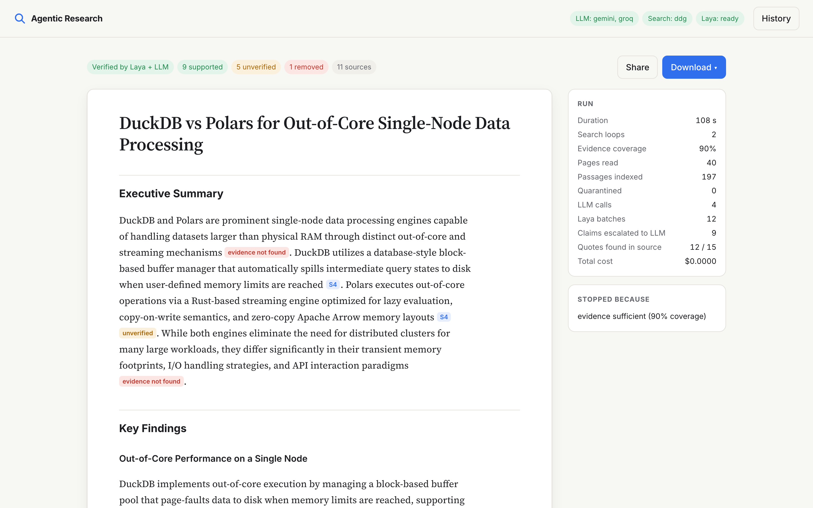
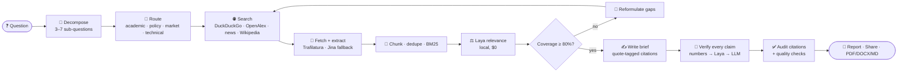
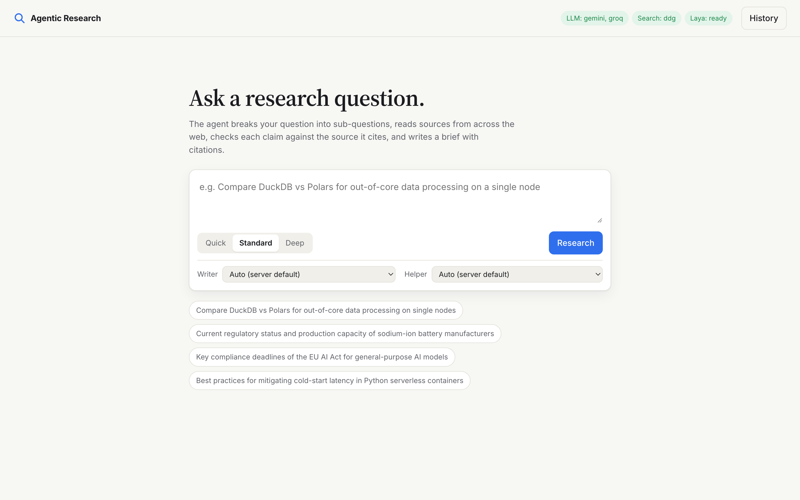

<div align="center">

# 🔎 Agentic Research

### Ask a question. Get a cited, fact-checked research brief. Pay **$0.00**.

An autonomous research agent that plans, searches, reads, ranks, loops until the evidence is sufficient,
writes a brief with **word-for-word source quotes**, and then **checks every claim against its source**,
all on free LLM tiers plus a local decision model.

<br>

[](https://github.com/wi-fi2/agentic-research/actions/workflows/ci.yml)


[](LICENSE)

**[Quick start](#-quick-start)** · **[How it works](#-how-it-works)** · **[Features](#-features)** · **[Benchmarks](#-measured-not-guessed)** · **[Deploy](#-deploy-for-free)**

<br>



<sub>A real standard-depth run, "DuckDB vs Polars": 40 pages read, 12 of 15 quotes found in their sources, 1 refuted claim removed, <b>$0.0000</b>.</sub>

</div>

---

## ⚡ Why this exists

Most "AI research" tools either **cost money per query** or **make things up with confident citations**.
This one is built around two rules:

> **1. Every factual sentence must carry a quote copied from its source, and code checks that the quote is really there.**
> **2. Nothing in the pipeline needs a paid API.**

| | Typical LLM research app | **Agentic Research** |
|---|---|---|
| Cost per run | cents to dollars | **$0.00** (free tiers + local model) |
| Citations | links, trust me | **`[S3: "exact words from the source"]`**, located in the source by code |
| Fact-checking | none | **every claim** checked: numbers in code → local model → one batched LLM call |
| Hallucinated sources | silently kept | rewritten to **`[UNVERIFIED: Missing Citation]`** |
| Refuted claims | stay in the text | **removed** from the body and listed separately |
| Web text | pasted into the prompt | **XML-isolated** + regex screened for prompt injection |

---

## 🧠 How it works

A plain, bounded asyncio state machine with no agent framework, so every step is inspectable and testable.



**Division of labour.** Code owns the workflow. Free LLMs only *generate* (plan, reformulate, write).
**[Laya](https://pypi.org/project/laya/)**, a 421M-parameter open-source *System 1* decision model, makes the fast yes/no judgments locally.
Sufficiency, thresholds and aggregation are plain Python.

---

## ✨ Features

<p align="center">
  
</p>

<table>
<tr>
<td width="50%" valign="top">

### 🔬 Grounded by construction
- Writer must tag each fact with a **5–25 word verbatim quote**
- Quote locator: exact, fuzzy, or stitched-fragment matching
- Claim status: **supported · conflicting · unverified · removed**
- Facts kept apart from a labelled **Analyst Interpretation** section
- **Points of Disagreement** when sources conflict

</td>
<td width="50%" valign="top">

### 🚀 Fast and free
- Parallel search across backends, concurrent fetching
- 24 h cache for search, pages, Laya scores and plans
- Provider chain: **Gemini → Groq → OpenRouter → Ollama**
- Automatic fallback on 429 / 413 / 5xx / daily quota
- Per-model rate-limit buckets and quota cool-downs

</td>
</tr>
<tr>
<td valign="top">

### 🎛️ You choose the model
- Per-run **Writer** and **Helper** model picker in the UI
- Lists each provider's live models (paid ones are never offered)
- The pick is tried first; the chain stays as a safety net
- Same from the CLI: `--writer groq:openai/gpt-oss-120b`

</td>
<td valign="top">

### 🛡️ Guardrails
- Bounded loops plus cost and time budgets
- Per-domain circuit breaker, backoff with jitter
- SHA-256 + shingle-Jaccard deduplication
- Paywall blocklist, snippet fallback
- Optional access token and per-IP rate limit for public deploys

</td>
</tr>
<tr>
<td valign="top">

### 📡 Live, transparent runs
- Server-Sent Events timeline of every stage
- Per-facet evidence coverage as it fills in
- Counters: sources, passages, LLM calls, Laya tokens, **$ cost**
- Full run trace stored for every run

</td>
<td valign="top">

### 📤 Share and export
- Unguessable, revocable public links `/r/{slug}`
- X · LinkedIn · WhatsApp · Telegram · Reddit · Email · native share
- **PDF** (fpdf2 + bundled Unicode font), **DOCX** with live links, **Markdown**, print CSS
- Evidence Quotes appendix so readers can check the grounding

</td>
</tr>
</table>

---

## 📊 Measured, not guessed

Every tuning pass was benchmarked on real runs (free tiers, empty cache). Full write-up in [`PLAN.md`](PLAN.md).

| Metric | Before | After |
|---|---:|---:|
| Standard run, "DuckDB vs Polars" | 72.6–80.4 s | **37.4–45.2 s** |
| Warm re-run of the same question | n/a | **24.5 s** |
| Writer quotes found in the cited source (4-domain benchmark) | 67 % | **92 %** |
| Quotes found verbatim (224 claim/source pairs) | 108 | **190** |
| Cited sources per 4-question benchmark | 19 | **25** |
| LLM spend | $0.00 | **$0.00** |

> Honest note: the benchmark sets are small (13–224 items, one run per cell), so treat these as indicative.
> One finding was negative: Laya's claim verdicts added no accuracy over a trivial baseline, so the LLM verifier does the real checking and Laya handles relevance ranking.

---

## 🚀 Quick start

```bash
git clone https://github.com/wi-fi2/agentic-research.git && cd agentic-research
python3 -m venv .venv && source .venv/bin/activate
pip install -r requirements.txt
cp .env.example .env          # add at least one free key: GEMINI_API_KEY or GROQ_API_KEY
uvicorn app.main:app --reload # → http://localhost:8000
```

On first start Laya downloads ~850 MB of weights and loads in the background (~30 s). The server accepts requests meanwhile.

**CLI**

```bash
python cli.py "Compare DuckDB vs Polars for out-of-core processing" --depth quick
python cli.py "EU AI Act GPAI obligations" --writer gemini:gemini-3.5-flash --helper groq:openai/gpt-oss-20b
```

**Tests**

```bash
pip install -r requirements-dev.txt && pytest
```

---

## 🔑 Free keys you can use

| Role | Free option | Env var |
|---|---|---|
| ✍️ Writing (large context) | Google AI Studio (Gemini Flash) | `GEMINI_API_KEY` |
| ⚡ Planning and fact-checks | Groq | `GROQ_API_KEY` |
| 🧯 Backup | OpenRouter `:free` models / local Ollama | `OPENROUTER_API_KEY` / `OLLAMA_BASE_URL` |
| 🌐 Search | DuckDuckGo (no key), optional self-hosted SearXNG | `SEARXNG_URL` |
| ⚖️ Judgments | Laya, local | `LAYA_ENABLED`, `LAYA_DEVICE` |

Everything else (depth presets, budgets, timeouts, provider order) is documented in [`.env.example`](.env.example).
Keys live only in your local `.env`, which git ignores.

---

## 🎚️ Depth presets

| | Loops | Sub-questions | Specialist routing |
|---|:---:|:---:|:---:|
| **Quick** | 1 | 3 | off (speed) |
| **Standard** | 2 | 5 | ✅ |
| **Deep** | 3 | 7 | ✅ |

Routing sends academic facets to **OpenAlex**, market facets to **news**, policy and technical facets to **official sources**,
and adds **Wikipedia** for background, then ranks evidence by `relevance × authority × recency`.

---

## ☁️ Deploy for free

The Docker image uses CPU-only torch and **bakes in the Laya weights**. No browser and no Cairo needed.

| Host | Notes |
|---|---|
| **Hugging Face Spaces** | Docker Space, keys as Space secrets, listens on `7860`. 16 GB free CPU is plenty |
| **Railway / Fly / Cloud Run** | ≥ 2.5 GB RAM for Laya, `$PORT` honoured |
| Render free (512 MB) | too small with Laya. Set `LAYA_ENABLED=false` to run BM25 + LLM-only |

### Google Cloud Run

```bash
PROJECT_ID=my-project SECRETS="GROQ_API_KEY=groq-key:latest,ACCESS_TOKEN=access-token:latest" ./deploy/cloudrun.sh
```

[`deploy/cloudrun.sh`](deploy/cloudrun.sh) builds the image with Cloud Build into Artifact Registry and deploys it with 4 GiB RAM (scale to zero).
Keys come from Secret Manager. The same script runs from the manual **Deploy to Cloud Run** GitHub Actions workflow using Workload Identity Federation. Note that the SQLite store is ephemeral on Cloud Run, so share links reset on cold start.

On a public instance set `ACCESS_TOKEN` and keep `RUNS_PER_HOUR_PER_IP` low so nobody else can use up your free quotas.
Shared `/r/{slug}` links stay public and read-only. Mount a volume at `DB_PATH` if share links must survive restarts.

---

## 🔌 MCP server

The agent is also an [MCP](https://modelcontextprotocol.io) server, so Claude Desktop, Claude Code or Cursor can call it as a tool.

| Tool | What it does |
|---|---|
| `research(question, depth)` | runs the full pipeline, returns the cited, fact-checked Markdown brief |
| `list_runs(limit)` | recent runs from the shared SQLite store |
| `get_report(run_id)` | fetches a finished brief |

```bash
claude mcp add agentic-research -- /path/to/.venv/bin/python /path/to/mcp_server.py
```

For Claude Desktop add the same command and args under `mcpServers` in `claude_desktop_config.json`. Keys are read from `.env` as usual.

---

## 🗂️ Project layout

```
app/
├── agent.py        bounded research state machine (decompose → … → finalize)
├── llm.py          free-tier provider chain, fallback, model picker
├── laya_judge.py   local relevance scoring + verification cascade
├── routing.py      facet classification, OpenAlex / Wikipedia / news, authority & recency
├── search.py       SearXNG → DuckDuckGo → Tavily → Brave
├── extractor.py    httpx + Trafilatura, Jina fallback, circuit breaker
├── evidence.py     chunking, dedup, BM25
├── report.py       citation audit, claim extraction, bibliography, QA
├── exporters.py    PDF / DOCX / Markdown
├── store.py        SQLite: runs, share links, cache
├── main.py         FastAPI + SSE
└── static/         single-page UI, no build step
cli.py · tests/ · Dockerfile · PLAN.md (design + measurements)
```

---

## 🛣️ Roadmap

- [ ] Eval runner over the labelled claim/source set (claim support, quote recall, latency)
- [ ] Langfuse tracing
- [ ] Faster relevance ranking (small cross-encoder) and streaming search → fetch
- [ ] Quote-window evidence for the LLM fact-checker
- [ ] More keyless sources: arXiv, Semantic Scholar, Crossref, PubMed

---

## 📄 License

[MIT](LICENSE). Use it, fork it, ship it.

---

<div align="center">

**Built to be cheap, careful and checkable.**
If it saved you a research afternoon, drop a ⭐

</div>
